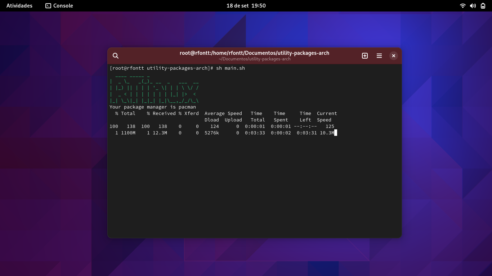

<hr />
<h3 align="center"> RTinux - Universal Linux Utility Package Downloader</h3>
<hr/>

### Introducing Our Universal Linux Utility Package Downloader

Are you looking to seamlessly transition into the world of Linux? Our revolutionary system has you covered, simplifying the process of installing and formatting your computer for Linux use across any distribution.

Embracing the power of Linux is an excellent choice, whether you're a seasoned Linux enthusiast or a curious newcomer. However, the diverse landscape of Linux distributions can sometimes be a bit overwhelming. Each distro has its unique package management system, which can make it challenging to gather essential utility packages efficiently. That's where our system comes in to make your life easier.

### Streamlined Installation Process

Our system acts as a one-stop solution to download and install utility packages on various Linux distributions. Whether you're setting up a new machine or performing a fresh Linux installation, our tool eliminates the need to scour the internet for specific packages or navigate complex package managers.

### Cross-Distribution Compatibility

No matter if you prefer Ubuntu, Fedora, Debian, Arch Linux, or any other distribution, our tool is designed to work seamlessly across all of them. It recognizes the underlying package management system and ensures that you have the necessary utilities at your fingertips, all within a unified and user-friendly interface.

### Enhanced Efficiency

By automating the process of downloading utility packages, our system not only saves you time but also minimizes the potential for errors. Say goodbye to manually searching for and installing each package one by one. With our solution, you can quickly get your Linux environment up and running with the essential tools you need.

### Open Source and Customizable

I believe in the spirit of open source, and our tool is no exception. It's designed to be easily adaptable to your specific needs. Whether you're a casual user or a Linux power user, you can customize the utility packages to fit your preferences.

### How to run?

```sh
sudo sh packages_automatizeted.sh
```

<div style="text-align:center;">
  
</div>
